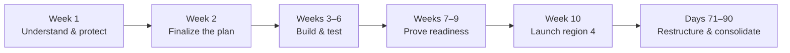

# Engineering Manager / Senior Manager — Take-Home Challenge

## Part A — My 90-day plan

### Objectives, diagnosis, and priorities

My objectives are to launch region 4 by week 10 and achieve zero money-impacting incidents. I will run launch delivery and reliability work in parallel, prioritizing safeguards that also make the new region safer.

**Diagnosis**

- **Weak money safeguards. Evidence:** incident #1 lacked idempotency; #4 used float arithmetic; three of incidents #5–9 involved payment-adjacent changes that passed review.
- **Late quality checks and a QA bottleneck. Evidence:** QA finds regressions late, releases have slipped from weekly to roughly bi-weekly, and the bug backlog grew 30% quarter over quarter. QA understaffing remains a hypothesis to assess.
- **Single points of knowledge. Evidence:** S. is the only wallet expert; two pipeline stalls occurred while T. was on leave.
- **Coaching and workload concerns. Evidence:** the handover says S.'s reviews make juniors cry and describes T. as stretched while also covering pipeline on-call.
- **Possible cross-squad coordination gaps. Evidence:** Payments has seven BE engineers and Web & Backoffice has six FE engineers. Whether this causes handoff delays needs validation.
- **Weak operational readiness and incident response. Evidence:** a batch job exhausted the DB pool and blocked withdrawals for six hours; MTTR is rising, and incident handling is informal.
- **Weak launch planning and learning. Evidence:** region 2 used incorrect provider credentials and suffered a six-hour outage; region 3 took four months against a six-week plan, with no post-mortem. The only delivery metric is an untrusted burndown chart.

**Trade-offs**

First, contain any continuing money risk and prevent known failures from recurring. In parallel, protect capacity for region 4's payment integrations, required regulatory differences, and launch readiness. Next, reduce knowledge dependencies and late regression discovery.

This quarter I will defer unrelated features, broad architecture rewrites, and low-severity backlog cleanup. I will keep the current squads through the launch and begin restructuring after launch stabilization, using evidence from delivery. I will agree the deferred list with Product and the CEO. If the launch is threatened, I will escalate early with scope and staffing options; money correctness and mandatory regulatory requirements remain release conditions.

### Execution plan



*Reliability improvements, QA support, and knowledge transfer continue throughout.*

**Week 1 — Understand the workload and establish immediate protection**

- **Launch kickoff with the three leads:** identify region-4 requirements, squad dependencies, and lessons from regions 2 and 3. Request workloads and proposed deferrals within two working days.
- **Review recent incidents:** verify money fixes and regression coverage, prioritize remaining risks, and identify where recovery was delayed.
- **Meet both QA engineers:** review the testing process, blockers, workload, and release waiting time to understand the bottleneck.
- **Establish temporary incident coverage:** name primary responders, backups, and escalation contacts for critical services.

**Week 2 — Finalize the plan**

- **Finalize the launch plan:** agree scope, milestones, owners, dependencies, and contingency time with the three leads.
- **Confirm capacity:** agree shared priorities, deferred work, and BE, FE, and QA availability within the current squads.
- **Confirm external dependencies:** name business owners and validate provider onboarding and regulatory sign-off deadlines.
- **Agree team improvements:** set reliability targets, identify capacity gaps, and begin wallet and pipeline knowledge transfer.

**Epic — Region Launching**

Create one epic for the region-4 launch. Mark every item in this epic **P0**, with an accountable owner, deadline, and acceptance criteria. Link dependencies to make the execution order clear and review progress weekly with the three leads.

**Weeks 3–6 — Deliver and reduce risk**

- **Build and test integrations:** deliver regional requirements and test duplicate callbacks, retries, concurrency, partial failures, and currency rounding.
- **Improve testing:** engineers own automated regression coverage; QA focuses on exploratory testing and critical journeys. Validate regional configuration early.
- **Practise recovery:** train wallet and pipeline backups and test their runbooks.
- **Review progress weekly:** track dependencies, risks, and QA queues; adjust scope and priorities before delays accumulate.

**Weeks 7–9 — Prove readiness**

- **Validate launch requirements:** complete provider checks, end-to-end tests, regional configuration checks, and required compliance sign-off.
- **Rehearse deployment and recovery:** practise incident response and safe containment of money-processing failures.
- **Confirm operational readiness:** verify monitoring, support preparation, incident coverage, and launch stop criteria.
- **Resolve launch blockers:** escalate any mandatory gate at risk with a corrective plan before week 10.

**Week 10 — Launch region 4**

- **Launch after readiness checks:** use staged exposure where supported, with mandatory gates satisfied.
- **Monitor closely:** staff launch observation and watch payment flows, balances, and alerts.
- **Respond to failures:** apply stop criteria, contain affected money flows, and activate the incident process when needed.

**Days 71–90 — Restructure and consolidate**

- **Review the launch:** capture lessons and update the reusable regional checklist.
- **Restructure the teams:** after launch stabilization, agree and begin changes based on observed dependencies, capacity gaps, and delivery ownership.
- **Align lead management:** agree expectations for planning, delegation, coaching, feedback, and shared responsibility for quality.
- **Revalidate hiring:** decide which roles to fill based on the agreed team structure and workload.
- **Consolidate reliability:** close high-risk actions, review success metrics, and verify recovery without S. or T. directing every step.

### Three process changes

1. **Release checklist:** check money tests, regional configuration, monitoring, and recovery steps before release to prevent repeat failures; success means fewer production regressions and no repeat money incidents.
2. **Incident process:** assign responders, backups, escalation rules, and communication responsibilities to reduce recovery delays; success means faster response and completed actions to prevent recurrence.
3. **Weekly progress review:** meet the three leads to review launch progress, blockers, QA workload, and priorities; success means earlier decisions and fewer launch delays.

### Team success metrics

| Metric | Success target | Why it matters |
|---|---|---|
| Money safety | Zero new money-impacting incidents during the 90 days. | Directly addresses the board's objective. |
| Region-4 delivery | Launch by week 10, with all P0 launch items meeting their acceptance criteria and mandatory checks passed. | Measures delivery of the business commitment. |
| Incident response | Critical incidents acknowledged within 15 minutes; mitigation time improves compared with the previous 90 days. | Shows whether incident coverage and recovery practices work. |
| Release quality and flow | Restore weekly releases by day 90, with fewer escaped regressions per release. | Shows that delivery improves alongside quality. |
| Knowledge coverage | At least two engineers can operate and recover each of the wallet and pipeline services, demonstrated in recovery drills by launch. | Reduces dependence on S. and T. |

The 15-minute acknowledgement target is a proposed operational commitment to confirm with the leads and agreed incident coverage.

### People, hiring, and QA capacity

- **Post-launch restructuring:** use launch evidence to improve team boundaries, capacity, and delivery ownership. Agree changes with the three leads after launch stabilization.
- **Lead coaching:** hold weekly 1:1 meetings with each lead to discuss planning, delegation, feedback, and developing backups. Use recent examples, agree one or two actions, and review progress at the next meeting.
- **S.:** Use weekly 1:1 meetings to address harmful review behavior and set clear expectations for respectful, actionable feedback. Assign responsibility for wallet safeguards and developing backups; reduce dependence on his personal approval.
- **D.:** Give supported ownership of bounded payment areas, pairing and qualified review. Build at least one additional wallet maintainer rather than spreading ownership without competence.
- **T. and CRM & Data:** Reduce competing work, prioritize the backlog, and train a pipeline backup with the access and runbook needed to recover it. Remove sole on-call responsibility.
- **L.:** Involve L. in the launch plan and practical release checklist. Use their management experience while protecting Web & Backoffice delivery and avoiding unlimited cross-squad support.
- **QA:** Make engineers responsible for tests and regression fixes. Protect QA's time for high-risk validation. Assess capacity gaps and arrange temporary support within the current team; use the findings in the post-launch hiring review.
- **Hiring:** Pause recruitment for the two open BE positions to stabilize the current team and protect time for delivery, coaching, and knowledge transfer. Reassess hiring after launch and team restructuring.

---

## Part B — PR #482

### 1. PR review

Original excerpts are from the supplied diff; `// ...` marks omitted lines. Suggested code is a focused example for each fix, with shared transaction logic in issue 3. Authentication helpers, the stored run/period lookup, and processing helpers must be integrated with the application; they are not present in the supplied diff. Account fields and period fields must be added where needed.

**Request changes — block tomorrow's merge and deployment.** This can pay the wrong brands, pay twice, overwrite concurrent wallet changes, and credit money without a ledger entry. The passing tests do not establish payout safety.

#### 1. [P0] Brand isolation

**Location:** `cashbackService.ts:14,23,37`

**Issue:**

`accountId` is unused: every member is selected, and bet/wallet reads are unscoped. Running brand A also pays brand B. Scope these queries and payout records by account; add the account field to the payout model/migration. Test that another brand remains unchanged.

<details>
<summary>Current code</summary>

```typescript
export async function runWeeklyCashback(accountId: string): Promise<CashbackRunResult> {
  const weekStart = new Date(Date.now() - 7 * 24 * 60 * 60 * 1000);

  const members = await Member.findAll();
// ...
const bets = await Bet.findAll({
  where: { memberId: member.id, createdAt: { [Op.gte]: weekStart } },
});
// ...
const wallet = await Wallet.findOne({ where: { memberId: member.id } });
```

</details>

<details>
<summary>Suggested fix</summary>

```typescript
// Use the fixed period assigned to this scheduled run.
const members = await Member.findAll({
  where: { accountId },
  order: [['id', 'ASC']],
  limit: MEMBER_BATCH_SIZE, // Continue through all batches; see issue 6.
});

const bets = await Bet.findAll({
  where: {
    accountId,
    memberId: member.id,
    createdAt: { [Op.gte]: period.start, [Op.lt]: period.end },
  },
});

const wallet = await Wallet.findOne({
  where: { accountId, memberId: member.id },
  transaction: t,
  lock: true,
});
// Include accountId in the payout record; see issues 2 and 3.
```

</details>

#### 2. [P0] Idempotency issue

**Location:** `cashbackService.ts:12,19,42–49` / payout migration

**Issue:**

If the process crashes partway through the loop, retrying the request starts again and can pay already-credited members twice. Retrying after partial failures has the same risk; there is no idempotency protection.

Add a required `idempotencyKey` to each cashback payout record, model, and migration, with a database unique constraint. Derive it from `accountId`, `memberId`, and a fixed payout period reused on retries; the current `weekStart` changes on every call. Claim the key and credit the wallet in the same transaction. Test partial-run retries and concurrent requests.

<details>
<summary>Current code</summary>

```typescript
const weekStart = new Date(Date.now() - 7 * 24 * 60 * 60 * 1000);
// ...
for (const member of members) {
  // ...
  wallet.balance = String(parseFloat(wallet.balance) + cashback);
  await wallet.save();

  await CashbackPayout.create({
    memberId: member.id,
    amount: cashback,
    weekStart,
  });
  // ...
}
```

</details>

<details>
<summary>Suggested fix</summary>

```javascript
// Add these fields to the new cashback_payouts table.
account_id: { type: Sequelize.UUID, allowNull: false },
week_end: { type: Sequelize.DATE, allowNull: false },
idempotency_key: { type: Sequelize.TEXT, allowNull: false },

// After createTable(), in the migration:
await queryInterface.addConstraint('cashback_payouts', {
  fields: ['idempotency_key'],
  type: 'unique',
  name: 'cashback_payouts_idempotency_key_uq',
});
```

```typescript
// Add corresponding declarations and attributes to CashbackPayout.
declare accountId: string;
declare weekEnd: Date;
declare idempotencyKey: string;

// Inside CashbackPayout.init({...}):
accountId: { type: DataTypes.UUID, allowNull: false },
weekEnd: { type: DataTypes.DATE, allowNull: false },
idempotencyKey: { type: DataTypes.TEXT, allowNull: false },

// The scheduled run stores these dates; retries reuse them.
const idempotencyKey = JSON.stringify([
  'weekly-cashback', accountId, member.id,
  period.start.toISOString(), period.end.toISOString(),
]);

await creditCashbackOnce({
  accountId, memberId: member.id, amount: cashbackAmount,
  period, idempotencyKey,
}); // Transaction and duplicate handling shown in issue 3.
```

</details>

#### 3. [P0] Atomic wallet writes

**Location:** `cashbackService.ts:37–55`

**Issue:**

Wallet save can succeed before payout/ledger creation fails. Read-modify-save can also overwrite a concurrent deposit or withdrawal. Commit the wallet update, payout record, and ledger entry in one transaction per member, with locking or a safe atomic update and the idempotency claim inside that transaction. Test rollback and concurrent wallet changes. All wallet writers must follow the same locking or atomic-update convention.

<details>
<summary>Current code</summary>

```typescript
const wallet = await Wallet.findOne({ where: { memberId: member.id } });
if (!wallet) {
  continue;
}

wallet.balance = String(parseFloat(wallet.balance) + cashback);
await wallet.save();

await CashbackPayout.create({
  memberId: member.id,
  amount: cashback,
  weekStart,
});

await WalletTx.create({
  walletId: wallet.id,
  type: 'CashbackCredit',
  amount: String(cashback),
});
```

</details>

<details>
<summary>Suggested fix</summary>

```typescript
import { UniqueConstraintError } from 'sequelize';

// creditCashbackOnce(): inputs shown in issue 2.
try {
  return await sequelize.transaction(async (t) => {
    const wallet = await Wallet.findOne({
      where: { accountId, memberId },
      transaction: t,
      lock: true,
    });
    if (!wallet) throw new Error('Cashback wallet missing');

    // A duplicate claim fails before the balance changes.
    await CashbackPayout.create({
      accountId, memberId, amount, idempotencyKey,
      weekStart: period.start, weekEnd: period.end,
    }, { transaction: t });

    wallet.balance = dec(wallet.balance).plus(dec(amount)).toFixed(18);
    await wallet.save({ transaction: t });
    await WalletTx.create({
      accountId, walletId: wallet.id,
      type: 'CashbackCredit', amount,
    }, { transaction: t });

    return 'paid';
  });
} catch (err) {
  // Catch outside the transaction: PostgreSQL errors require rollback.
  if (err instanceof UniqueConstraintError) {
    const cause = err.original as Error & { constraint?: string };
    if (cause.constraint === 'cashback_payouts_idempotency_key_uq') {
      return 'already-paid';
    }
  }
  throw err; // Other failures must remain visible.
}
```

</details>

#### 4. [P0] Decimal money

**Location:** `cashbackService.ts:26–42` / migration `amount` / model

**Issue:**

`parseFloat`, native arithmetic, and `FLOAT` violate the money contract. Use `dec()`, decimal strings, `DECIMAL(36,18)`, and an explicit rounding policy. Test fractional and large amounts; converting a float back to a string does not restore precision.

<details>
<summary>Current code</summary>

```typescript
let netLoss = 0;
for (const bet of bets) {
  netLoss += parseFloat(bet.amount) - parseFloat(bet.payout);
}

if (netLoss <= 0) {
  continue;
}

const cashback = netLoss * CASHBACK_RATE;
// ...
wallet.balance = String(parseFloat(wallet.balance) + cashback);
```

Migration and model:

```typescript
amount: { type: Sequelize.FLOAT, allowNull: false },
declare amount: number;
amount: { type: DataTypes.FLOAT, allowNull: false },
```

</details>

<details>
<summary>Suggested fix</summary>

```typescript
import BigNumber from 'bignumber.js';
import { dec } from '../lib/money';

const CASHBACK_RATE = '0.05';
let netLoss = dec('0');
for (const bet of bets) {
  netLoss = netLoss.plus(dec(bet.amount).minus(dec(bet.payout)));
}
if (netLoss.lte(0)) continue;

// Example policy: half-up at scale 18; confirm the approved payout policy.
const cashbackAmount = netLoss.multipliedBy(dec(CASHBACK_RATE))
  .toFixed(18, BigNumber.ROUND_HALF_UP);
if (dec(cashbackAmount).lte(0)) continue;

// Keep this string through payout creation and the wallet transaction.
```

```typescript
// Migration:
amount: { type: Sequelize.DECIMAL(36, 18), allowNull: false },

// Model declaration:
declare amount: string;

// Model attribute:
amount: { type: DataTypes.DECIMAL(36, 18), allowNull: false },
```

</details>

#### 5. [P0] Verify access control

**Location:** `admin.ts:11–15` / `app.ts`

**Issue:**

No authentication or account authorization is shown here. Please show the existing protection or add it before release. A valid UUID does not authorize a payout. Add endpoint tests for unauthenticated callers and callers without access to the requested brand.

<details>
<summary>Current code</summary>

```typescript
adminRouter.post('/cashback/run', async (req, res, next) => {
  try {
    const body = runCashbackBody.parse(req.body);
    const result = await runWeeklyCashback(body.accountId);
    res.json({ ok: true, ...result });
  } catch (err) {
    next(err);
  }
});
// app.ts
app.use('/admin', adminRouter);
```

</details>

<details>
<summary>Suggested fix</summary>

```typescript
// Use the application's real authentication/authorization helpers.
// Extend body validation to require the scheduled runId as well.
adminRouter.post('/cashback/run', requireAdmin, async (req, res, next) => {
  try {
    const body = runCashbackBody.parse(req.body);
    await assertAccountAccess(req.user, body.accountId);

    // Server lookup validates run ownership and returns its stored dates.
    const period = await loadCashbackPeriod(body.accountId, body.runId);
    const result = await runWeeklyCashback(body.accountId, period);
    res.status(result.failed > 0 ? 503 : 200)
      .json({ ok: result.failed === 0, ...result });
  } catch (err) {
    next(err);
  }
});
```

</details>

#### 6. [P1] Bound member loading

**Location:** `cashbackService.ts:14`

**Issue:**

`Member.findAll()` loads the entire member table into memory. As membership grows, this can exhaust service memory. Scope by `accountId` and process all eligible members through deterministic pagination with a bounded batch size. Validate memory use and runtime with representative data. Also bound bet loading or aggregate net losses with exact database arithmetic; member pagination alone does not bound a busy member's bet history.

<details>
<summary>Current code</summary>

```typescript
const members = await Member.findAll();
```

</details>

<details>
<summary>Suggested fix</summary>

```typescript
const MEMBER_BATCH_SIZE = 500; // Tune using measured memory/runtime.
let cursor: string | undefined;

while (true) {
  const members = await Member.findAll({
    where: {
      accountId,
      ...(cursor ? { id: { [Op.gt]: cursor } } : {}),
    },
    attributes: ['id'],
    order: [['id', 'ASC']],
    limit: MEMBER_BATCH_SIZE,
  });
  if (members.length === 0) break;

  for (const member of members) {
    await processMember(member, accountId, period);
  }
  cursor = members[members.length - 1].id;
}
```

</details>

#### 7. [P1] Failure handling and debugging logs

**Location:** `cashbackService.ts:14,37–39,58–63` / `admin.ts:15`

**Issue:**

There is a per-member `try/catch` and a `console.log`, but errors are swallowed, missing wallets are silently skipped, and the endpoint still returns `ok: true`. Replace `console.log` with the application's logging package through a shared logger. Use structured logs with severity, `accountId`, `runId`, `memberId`, and the error stack; count failed members and alert on incomplete runs. Throw an error for an eligible member with a missing wallet. Propagate errors that abort the run to the route error handler. Retry only after rollback, using the same payout period and idempotency key. Test member failures and failures that stop the entire run.

<details>
<summary>Current code</summary>

`src/services/cashbackService.ts` — original function:

```typescript
export async function runWeeklyCashback(accountId: string): Promise<CashbackRunResult> {
  const weekStart = new Date(Date.now() - 7 * 24 * 60 * 60 * 1000);

  const members = await Member.findAll();

  let processed = 0;
  let paid = 0;

  for (const member of members) {
    processed++;
    try {
      const bets = await Bet.findAll({
        where: { memberId: member.id, createdAt: { [Op.gte]: weekStart } },
      });

      let netLoss = 0;
      for (const bet of bets) {
        netLoss += parseFloat(bet.amount) - parseFloat(bet.payout);
      }

      if (netLoss <= 0) {
        continue;
      }

      const cashback = netLoss * CASHBACK_RATE;

      const wallet = await Wallet.findOne({ where: { memberId: member.id } });
      if (!wallet) {
        continue;
      }

      wallet.balance = String(parseFloat(wallet.balance) + cashback);
      await wallet.save();

      await CashbackPayout.create({
        memberId: member.id,
        amount: cashback,
        weekStart,
      });

      await WalletTx.create({
        walletId: wallet.id,
        type: 'CashbackCredit',
        amount: String(cashback),
      });

      paid++;
    } catch (err) {
      console.log('cashback failed for member', member.id, err);
    }
  }

  return { processed, paid };
}
```

`src/routes/admin.ts` — original handler:

```typescript
adminRouter.post('/cashback/run', async (req, res, next) => {
  try {
    const body = runCashbackBody.parse(req.body);
    const result = await runWeeklyCashback(body.accountId);
    res.json({ ok: true, ...result });
  } catch (err) {
    next(err);
  }
});
```

</details>

<details>
<summary>Suggested fix</summary>

This patch changes failure reporting and logging. Apply it with the brand, transaction, decimal, and idempotency fixes above. Configure an alert for the incomplete-run event.

Reuse the application's logging package. If a shared logger is needed, this [Pino example](https://github.com/pinojs/pino/blob/main/docs/api.md) uses the package's error serializer to retain the error stack.

`src/lib/logger.ts`:

```typescript
import pino from 'pino';

export const logger = pino({
  name: 'wallet-service',
  level: process.env.LOG_LEVEL ?? 'info',
  serializers: { err: pino.stdSerializers.err },
});
```

`src/services/cashbackService.ts` — changes against the supplied code:

```diff
--- a/src/services/cashbackService.ts
+++ b/src/services/cashbackService.ts
@@ -1,3 +1,5 @@
+import { randomUUID } from 'node:crypto';
+import { logger } from '../lib/logger';
 import { Op } from 'sequelize';
 import { Member, Wallet, WalletTx, Bet, CashbackPayout } from '../db/models';
 
@@ -6,15 +8,23 @@
 export interface CashbackRunResult {
   processed: number;
   paid: number;
+  failed: number;
 }
 
 export async function runWeeklyCashback(accountId: string): Promise<CashbackRunResult> {
+  const runId = randomUUID(); // Correlates logs for this invocation.
+  const log = logger.child({ accountId, runId });
+  log.info('Cashback run started');
   const weekStart = new Date(Date.now() - 7 * 24 * 60 * 60 * 1000);
 
-  const members = await Member.findAll();
+  const members = await Member.findAll().catch((err: unknown) => {
+    log.error({ err }, 'Cashback run aborted while loading members');
+    throw err;
+  });
 
   let processed = 0;
   let paid = 0;
+  let failed = 0;
 
   for (const member of members) {
     processed++;
@@ -36,7 +46,7 @@
 
       const wallet = await Wallet.findOne({ where: { memberId: member.id } });
       if (!wallet) {
-        continue;
+        throw new Error('Eligible cashback member has no wallet');
       }
 
       wallet.balance = String(parseFloat(wallet.balance) + cashback);
@@ -56,9 +66,16 @@
 
       paid++;
     } catch (err) {
-      console.log('cashback failed for member', member.id, err);
+      failed++;
+      log.error({ err, memberId: member.id }, 'Cashback member failed');
     }
   }
 
-  return { processed, paid };
+  const result = { processed, paid, failed };
+  if (failed > 0) {
+    log.error(result, 'Cashback run incomplete');
+  } else {
+    log.info(result, 'Cashback run completed');
+  }
+  return result;
 }
```

`src/routes/admin.ts` — expose partial failure and keep the existing `next(err)` handler:

```diff
--- a/src/routes/admin.ts
+++ b/src/routes/admin.ts
@@ -12,7 +12,8 @@
   try {
     const body = runCashbackBody.parse(req.body);
     const result = await runWeeklyCashback(body.accountId);
-    res.json({ ok: true, ...result });
+    res.status(result.failed > 0 ? 503 : 200)
+      .json({ ok: result.failed === 0, ...result });
   } catch (err) {
     next(err);
   }
```

The generated `runId` identifies this invocation in the logs. Retry protection uses the stored payout period and unique key from issue 2.

</details>

#### 8. [P1] Assert financial behavior

**Location:** `cashback.test.ts`

**Issue:**

The existing tests cover losing and winning members, but do not test failure paths or assert exact money values. Keep the successful-payout test and add missing-wallet, failed-read, failed-write, and partial-run cases. Use PostgreSQL integration tests to prove rollback, safe retries, concurrent execution, brand isolation, and decimal correctness. Show these passing before the release is rescheduled.

<details>
<summary>Current code</summary>

`test/cashback.test.ts` — supplied test file:

```typescript
import { runWeeklyCashback } from '../src/services/cashbackService';
import { Member, Wallet, WalletTx, Bet, CashbackPayout } from '../src/db/models';

jest.mock('../src/db/models', () => ({
  Member: { findAll: jest.fn() },
  Wallet: { findOne: jest.fn() },
  WalletTx: { create: jest.fn() },
  Bet: { findAll: jest.fn() },
  CashbackPayout: { create: jest.fn() },
}));

describe('runWeeklyCashback', () => {
  it('pays cashback to losing members', async () => {
    (Member.findAll as jest.Mock).mockResolvedValue([{ id: 'm1' }]);
    (Bet.findAll as jest.Mock).mockResolvedValue([
      { amount: '100', payout: '40' },
    ]);
    const save = jest.fn();
    (Wallet.findOne as jest.Mock).mockResolvedValue({
      id: 'w1',
      balance: '10',
      save,
    });

    const result = await runWeeklyCashback('acc1');

    expect(result.paid).toBe(1);
    expect(save).toHaveBeenCalled();
    expect(CashbackPayout.create).toHaveBeenCalled();
    expect(WalletTx.create).toHaveBeenCalled();
  });

  it('skips winning members', async () => {
    (Member.findAll as jest.Mock).mockResolvedValue([{ id: 'm1' }]);
    (Bet.findAll as jest.Mock).mockResolvedValue([{ amount: '10', payout: '50' }]);
    const result = await runWeeklyCashback('acc1');
    expect(result.paid).toBe(0);
  });
});
```

</details>

<details>
<summary>Suggested fix</summary>

**Keep exact amount assertions** for the losing-member fixture after the decimal and transaction fixes:

```typescript
// Keep the original Member/Bet fixtures and retain the wallet reference.
// Configure the transaction mock for the updated financial implementation.
const wallet = { id: 'w1', balance: '10', save: jest.fn() };
(Wallet.findOne as jest.Mock).mockResolvedValue(wallet);

const result = await runWeeklyCashback('acc1');
expect(result.paid).toBe(1);
expect(wallet.balance).toBe('13.000000000000000000');
expect(CashbackPayout.create).toHaveBeenCalledWith(
  expect.objectContaining({
    accountId: 'acc1', memberId: 'm1',
    amount: '3.000000000000000000',
  }),
  expect.objectContaining({ transaction: expect.anything() }),
);
expect(WalletTx.create).toHaveBeenCalledWith(
  expect.objectContaining({
    walletId: 'w1', type: 'CashbackCredit',
    amount: '3.000000000000000000',
  }),
  expect.objectContaining({ transaction: expect.anything() }),
);
```

**Add failure tests.** These examples target the failure-reporting changes in issue 7 and use the supplied model mocks:

```typescript
// Add alongside the supplied model mocks. This mocks the logger
// introduced in issue 7 without sending real log output.
jest.mock('../src/lib/logger', () => ({
  logger: { child: () => ({ info: jest.fn(), error: jest.fn() }) },
}));

beforeEach(() => jest.resetAllMocks());

it('reports an eligible member with a missing wallet as failed', async () => {
  (Member.findAll as jest.Mock).mockResolvedValue([{ id: 'm1' }]);
  (Bet.findAll as jest.Mock).mockResolvedValue([{ amount: '100', payout: '40' }]);
  (Wallet.findOne as jest.Mock).mockResolvedValue(null);

  const result = await runWeeklyCashback('acc1');

  expect(result).toEqual({ processed: 1, paid: 0, failed: 1 });
  expect(CashbackPayout.create).not.toHaveBeenCalled();
  expect(WalletTx.create).not.toHaveBeenCalled();
});

it('propagates a fatal member-query failure', async () => {
  const error = new Error('Member query unavailable');
  (Member.findAll as jest.Mock).mockRejectedValue(error);

  await expect(runWeeklyCashback('acc1')).rejects.toBe(error);
  expect(Bet.findAll).not.toHaveBeenCalled();
  expect(CashbackPayout.create).not.toHaveBeenCalled();
  expect(WalletTx.create).not.toHaveBeenCalled();
});

it('reports a ledger-write failure without counting it as paid', async () => {
  (Member.findAll as jest.Mock).mockResolvedValue([{ id: 'm1' }]);
  (Bet.findAll as jest.Mock).mockResolvedValue([{ amount: '100', payout: '40' }]);
  (Wallet.findOne as jest.Mock).mockResolvedValue({
    id: 'w1', balance: '10', save: jest.fn(),
  });
  (WalletTx.create as jest.Mock).mockRejectedValue(new Error('Ledger unavailable'));

  const result = await runWeeklyCashback('acc1');

  expect(result).toEqual({ processed: 1, paid: 0, failed: 1 });
});

it('reports a partial run when one member fails and another succeeds', async () => {
  (Member.findAll as jest.Mock).mockResolvedValue([{ id: 'm1' }, { id: 'm2' }]);
  (Bet.findAll as jest.Mock)
    .mockRejectedValueOnce(new Error('Bet lookup failed'))
    .mockResolvedValueOnce([{ amount: '100', payout: '40' }]);
  (Wallet.findOne as jest.Mock).mockResolvedValue({
    id: 'w2', balance: '10', save: jest.fn(),
  });

  const result = await runWeeklyCashback('acc1');

  expect(result).toEqual({ processed: 2, paid: 1, failed: 1 });
  expect(CashbackPayout.create).toHaveBeenCalledTimes(1);
  expect(WalletTx.create).toHaveBeenCalledTimes(1);
});
```

**Required database and endpoint cases:**

| Bad case or edge case | Required assertion |
|---|---|
| Ledger insertion fails after the balance update | The transaction rolls back: original balance, no payout record, and no ledger credit. A model mock alone cannot prove rollback. |
| Process stops after some members were paid, then the same period is retried | Previously paid members receive no second credit; unpaid eligible members are paid. |
| Two requests run the same account and period concurrently | Each member receives one credit, one payout record, and one matching ledger entry. |
| A deposit occurs during cashback processing | The final balance includes both the deposit and the single cashback credit. |
| Another brand has eligible members | Its balances, payouts, and ledger entries remain unchanged. |
| Fractional or large money values | Exact decimal results follow the agreed rounding policy; stake `0.3` minus payout `0.2` earns exactly `0.005`. |
| Zero or negative net loss | No credit, payout record, or ledger entry; balance remains unchanged. |
| One or more member payouts fail | Endpoint returns `ok: false` and the failed count; a fatal run error reaches the error handler. |
| Unauthenticated caller or caller without brand access | Request is rejected before any money is changed. |

These are proposed tests. Run database cases against PostgreSQL using fixed payout periods and isolated fixtures; the supplied diff does not include the full integration-test setup.

</details>

#### 9. [P3] Name the lookback duration

**Location:** `cashbackService.ts:12`

**Issue:**

Please extract `7 * 24 * 60 * 60 * 1000` into a named constant such as `CASHBACK_LOOKBACK_MS`, so the seven-day policy and millisecond units are clear.

<details>
<summary>Current code</summary>

```typescript
const weekStart = new Date(Date.now() - 7 * 24 * 60 * 60 * 1000);
```

</details>

<details>
<summary>Suggested fix</summary>

```typescript
const CASHBACK_LOOKBACK_MS = 7 * 24 * 60 * 60 * 1000;

// When creating the scheduled run, use its fixed end time.
const weekStart = new Date(periodEnd.getTime() - CASHBACK_LOOKBACK_MS);
// Store weekStart/periodEnd on the run; retries reuse them.
```

</details>

### 2. The conversation

I tell D. and S. today that tomorrow's merge and deployment are paused, linking the concrete failure cases. I own that release decision and agree the next review time.

With D., I walk through the failures and ask for targeted fixes and regression tests. D. keeps ownership of the PR; I arrange pairing with S. and protect time for the correction. The comments focus on behavior and financial impact.

With S., I hold a private 1:1. We reproduce the cases together and discuss the assumptions behind the approval. I set the expectation that wallet reviews verify brand isolation, idempotency, atomic writes, decimal arithmetic, and access control. S. owns strengthening the review checklist and training another qualified wallet reviewer.

To prevent recurrence, I require these checks in the money-change checklist and enforce the regression tests in CI, including database tests for concurrency and rollback. A qualified peer verifies the financial design. I sample reviews and track escaped money defects while the team owns the release checks. We agree the correction scope against region-4 capacity before rescheduling this promo release.

---

## Part C — Two situations

### C1 — Incorrect balances

**First 15 minutes:** Declare a critical incident. I lead coordination; S. and another Payments engineer investigate. Pause region-2 withdrawals and affected credits using verified controls; widen containment if needed. Preserve evidence and pending events. I assign a communication owner to coordinate stakeholder updates; Support handles player updates.

I tell the CEO: “Potentially. We are containing the affected flows, but actual money lost is unconfirmed. I will update you in 15 minutes.”

**First hour:** Finance and engineers compare balances, ledger entries, and provider transactions to identify affected players and actual losses. Use available engineers for reporting while T. is away.

**Hours 1–6:** S. proposes a fix or rollback; QA and a qualified peer verify it. Finance approves auditable corrections that preserve ledger history. Update Engineering, Support, Finance, Product, and the CEO every 30 minutes, and immediately when impact or containment changes. Support shares relevant updates with affected players.

**Hours 6–24:** Restore gradually after reconciliation and verification. Replay preserved events idempotently, monitor balances, and arrange responder shifts. Publish an incident summary and preventive actions with owners and deadlines. Schedule a blameless review within two working days.

**Communication is a core part of incident response. Every affected stakeholder must receive regular updates on impact, actions, uncertainty, and the next update time, even when there is no new progress.**

### C2 — L. challenges the release checklist

**Next 60 seconds:** First ask L.:

“L., what are your concerns about the checklist, and why do you think it is not a good approach?”

Listen, review the evidence, and clarify L.'s concerns. Once I understand them, explain why the checklist matters: it helps prevent repeat money incidents and launch mistakes. Remind the squads that we agreed to these checks, and following the agreed plan keeps the team coordinated and accountable. We can discuss and agree changes together; until then, everyone follows the current checklist.

**After planning:** Meet L. privately that day:

- **Agree on the concerns:** Acknowledge the launch pressure and agree which concerns the evidence supports. Commit to reviewing unnecessary steps together.
- **Explain the impact:** “Telling the squads to ignore an agreed requirement is serious. It creates conflicting instructions and weakens accountability. If one of your teammates told others to ignore your release instructions, how would that affect your ability to lead?”
- **Set the expectation and warning:** “If you have concerns, discuss them with me directly so we can agree changes. Do not instruct the team to bypass agreed requirements. This must not happen again. If it does, I will address it through the performance management process.”

Review L.'s evidence with Payments and QA, including time spent on checks, release waiting time, and duplicate work. Remove unnecessary steps, clarify owners, and retain essential safeguards. Share agreed changes with both squads by the next working day, ideally alongside L.

Track release waiting time and escaped regressions. Follow up in our weekly 1:1; repeated bypass instructions become a leadership accountability issue.

**Resolve conflict by listening and adapting the process. Money correctness and mandatory regulatory checks are firm limits that cannot be bypassed.**

---

## AI assistance disclosure

I used Codex to review and structure my drafts, inspect the supplied PR diff, check failure scenarios with a controlled mock-based harness, and help draft the responses.
